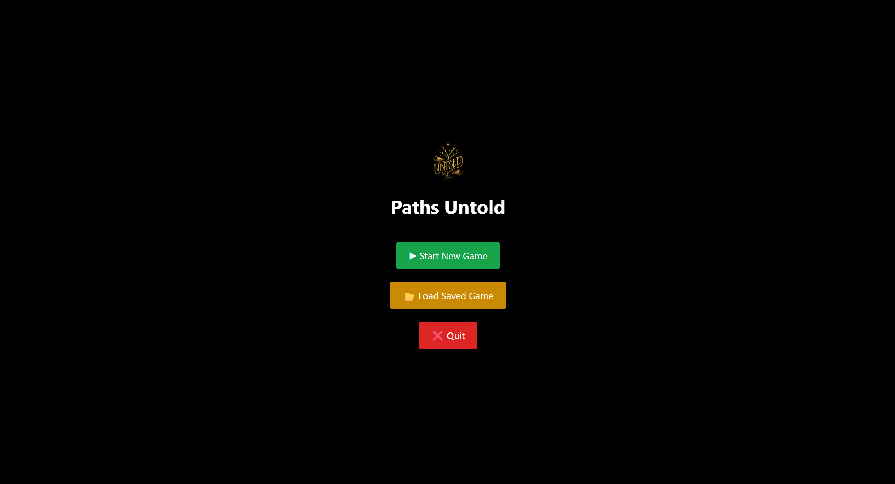
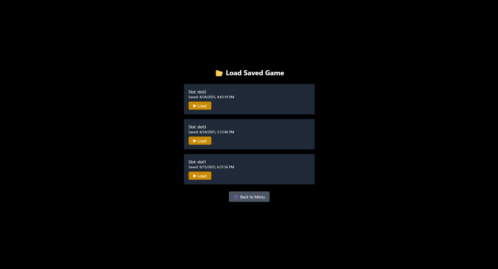
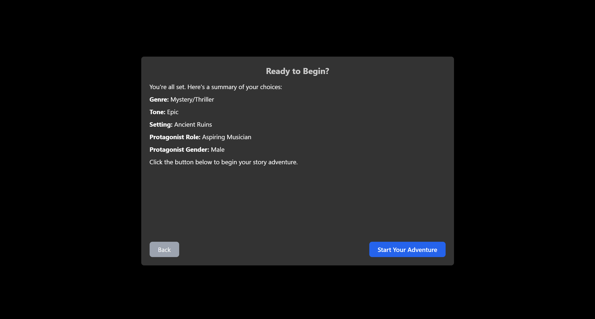
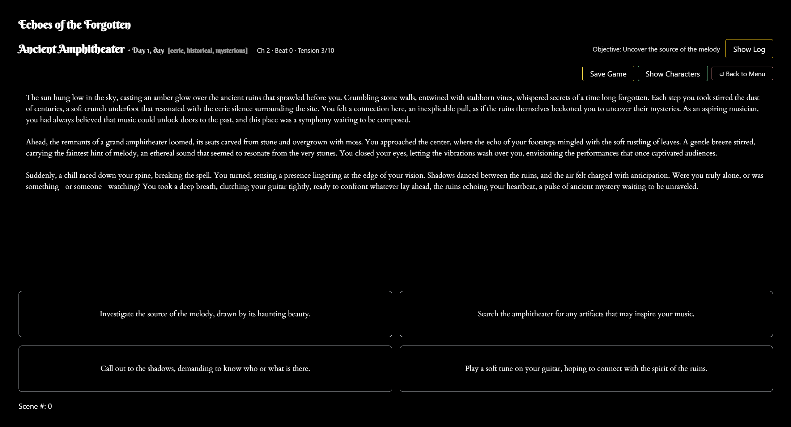
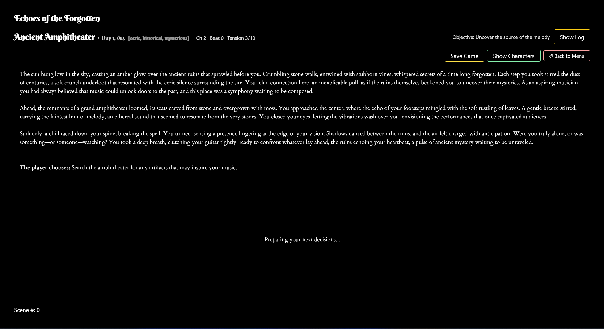
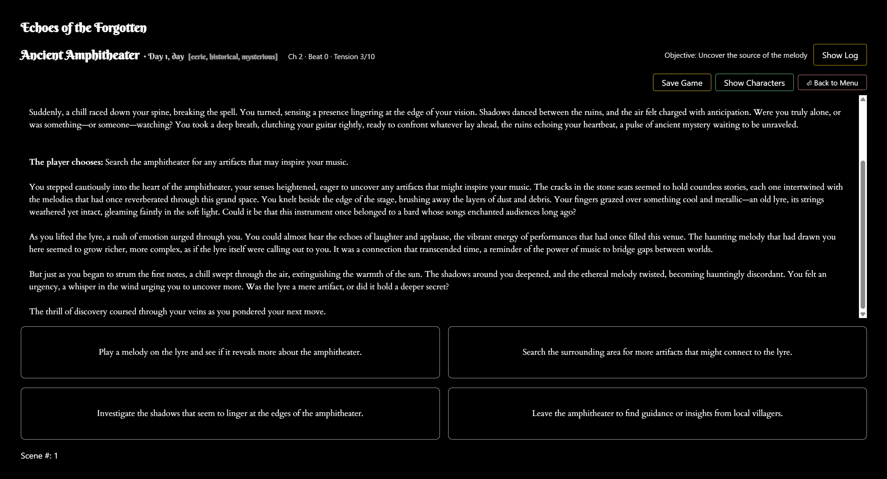

# 🌌 Paths Untold

**A Human-in-the-Loop, Stateful LLM Narrative Environment**

Paths Untold is an experimental interactive narrative system that explores how large language models behave under **persistent state, structured constraints, and sequential human decision-making** — wrapped inside a cozy, playable story game.

Rather than treating an LLM as a one-shot storyteller, Paths Untold frames narrative generation as a **long-horizon control problem**: each scene must remain coherent with accumulated history, character identity, emotional state, and player interventions.

At the same time, it is designed to be *pleasant to play*: calm pacing, evocative writing, and a warm interface where choices matter and characters feel remembered.

---

## ✨ What This Project Is

Paths Untold is both:

* **A research-oriented LLM system** for studying memory, coherence, and human–AI interaction
* **A narrative game** where players shape a living story through meaningful choices

It intentionally sits at the intersection of **systems design** and **interactive storytelling**.

---

## 🧠 System Overview (Under the Hood)

At its core, Paths Untold is a **stateful LLM environment** with three tightly coupled components:

### 1. Prompt Compilation (Not Just Prompting)

Each generation step is produced from a *unified prompt* that explicitly encodes:

* Current narrative context
* Persistent character memory (traits, relationships, emotions)
* A compressed summary of prior scenes (long-horizon memory)
* The player’s most recent action

This turns free-form generation into a **controlled transformation of world state**.

---

### 2. Structured Output & Parsing

LLM responses are parsed into a constrained schema containing:

* Narrative text
* Discrete player action options
* Updated character traits and emotional deltas
* Scene-level summaries for memory compression

This enforces a **contract** between the model and the system, making failures observable and debuggable rather than hidden inside prose.

---

### 3. Human-in-the-Loop Control

The player functions as an external decision-maker:

* Each choice represents an intervention in the system
* Actions feed back into persistent memory and future generations
* Small decisions accumulate into long-term narrative divergence

Interaction is treated as **sequential control**, not simple input.

---

## 🎮 The Game Experience

From the player’s perspective, Paths Untold is a quiet, choice-driven story game:

* Each scene presents a short narrative moment
* Four unique choices invite reflection rather than optimization
* Characters remember what you do and how you treat them
* Emotional tone shifts subtly over time

There are no timers, no scores, and no “correct” paths — only unfolding consequences.

---

## 🧩 Core Features

* **Dynamic scene-by-scene storytelling** powered by LLMs
* **Persistent character memory** (traits, relationships, emotional states)
* **Long-horizon coherence** via scene summaries and state compression
* **Discrete action space** for meaningful player intervention
* **Save / Load system** with multiple slots
* **Frontend + backend in one command**
* **Cozy UI** with Tailwind CSS, animated text, and atmospheric backgrounds

---

## 🏗 Architecture Overview

```
Human Choice
     ↓
State Update (Memory, Emotion, History)
     ↓
Prompt Compilation
     ↓
LLM Generation
     ↓
Schema Parsing & Validation
     ↓
World State Update
     ↺
```

---

## 🚀 Getting Started (Local Development)

### 1. Clone the repository

```bash
git clone https://github.com/qmanhbeo/paths-untold.git
cd paths-untold
```

---

### 2. Set up environment variables

#### Backend (`/server/.env`)

```env
OPENAI_API_KEY=sk-...your key...
UPSTREAM_URL=https://api.openai.com/v1/chat/completions
MODEL=gpt-4o-mini
PORT=5174
```

#### Frontend (root `.env`)

```env
REACT_APP_API_BASE=http://localhost:5174/api
REACT_APP_LLM_MODEL=gpt-4o-mini
```

⚠️ **Important**: Keep your API key only in `/server/.env`. The frontend `.env` must never contain secrets.

---

### 3. Install dependencies

```bash
npm install
npm --prefix server install
```

---

### 4. Run the game 🎮

```bash
npm run dev
```

By default:

* Game UI: [http://localhost:3000](http://localhost:3000)
* API proxy: [http://localhost:5174](http://localhost:5174)

---

## 🛠 Tech Stack

* **Frontend**: React (CRA), Tailwind CSS, React Hooks
* **Backend**: Express, CORS, node-fetch, zod (schema validation)
* **AI Integration**: OpenAI API via secure server proxy
* **State & Memory**: Custom managers for narrative state, character memory, and emotion tracking
* **Testing**: CRA Jest setup

---

## 📂 Project Structure

```
/components                     → UI components (GameScreen, StartScreen, etc.)
/components/GameScreenComponents → ChoiceGrid, HeaderBar, StoryDisplay
/utils                          → Core logic (AI orchestration, memory, parsing)
/server                         → Express proxy (API key isolation)
/images                         → Backgrounds and UI assets
/public                         → Logos, manifest, icons
```

---

## 🧭 Why Build This

Most LLM applications optimize for single-turn quality.

Paths Untold instead asks:

* How do models maintain identity over long horizons?
* How should memory be compressed without erasing causality?
* What failure modes emerge when narrative, emotion, and state drift?
* How does human intervention stabilize or destabilize generative trajectories?

The narrative domain makes these questions *legible* and *human-scale*.

---

## 🐉 Status

**Beta / research prototype**

Expect occasional parsing quirks and long generation times.

Planned improvements include:

* Streaming story text
* Stronger schema guarantees and recovery logic
* Expanded character lifecycle and relationship modeling
* Instrumentation for failure-mode analysis

---

Paths Untold is intentionally exploratory.

It is meant to be both a **quiet game** and a **serious experiment** — a place where stories unfold, and where long-horizon human–AI interaction can be observed, questioned, and understood.


## 👀 Visual Preview

Paths Untold is designed to feel calm, readable, and immersive — closer to a quiet book than a flashy game.

The screenshots below show the full interaction loop: starting a story, making choices, and watching narrative state evolve over time.

> These previews are provided so readers can understand the system and atmosphere **without installing dependencies or using an API key**.

---

### Start & Setup

**Start Screen**  
A minimal entry point into the narrative world.



**Save Slots**  
Multiple timelines can be saved and revisited, allowing parallel narrative exploration.



**Preferences**  
Lightweight configuration before entering the story.



---

### Narrative Flow

**Generated Scene**  
LLM-generated narrative grounded in accumulated state and memory.



**Player Choices**  
Discrete actions that intervene in the story and influence future generations.



**Ongoing Story**  
Consequences accumulate across scenes, maintaining tone, character identity, and emotional continuity.



---

The visuals are intentionally restrained.  
The focus is on **reading, choosing, and being remembered** — not spectacle.
